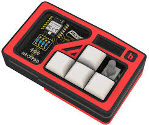
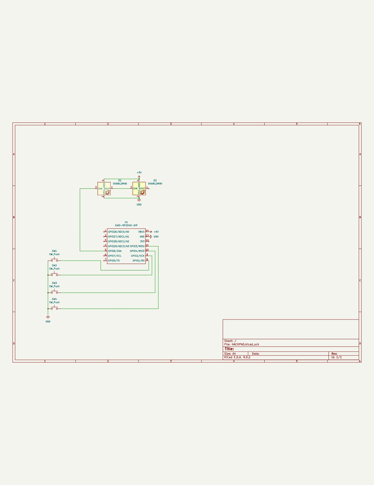
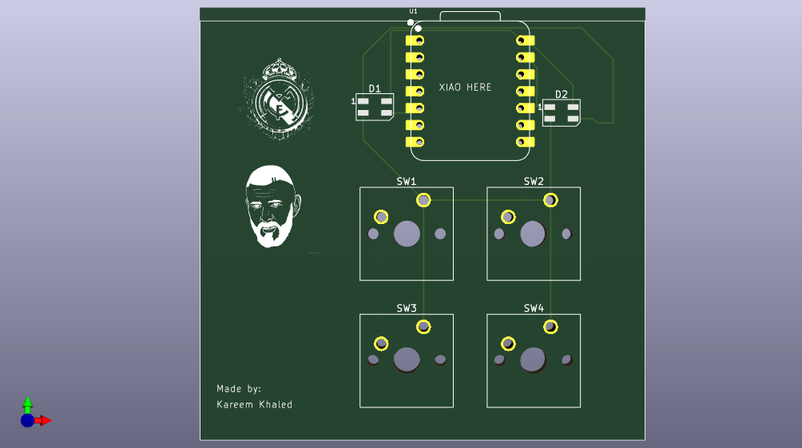
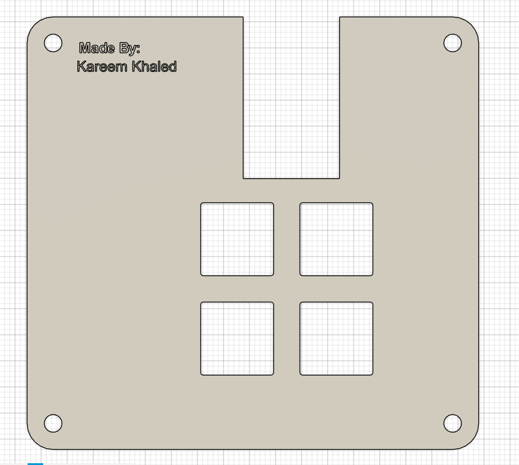
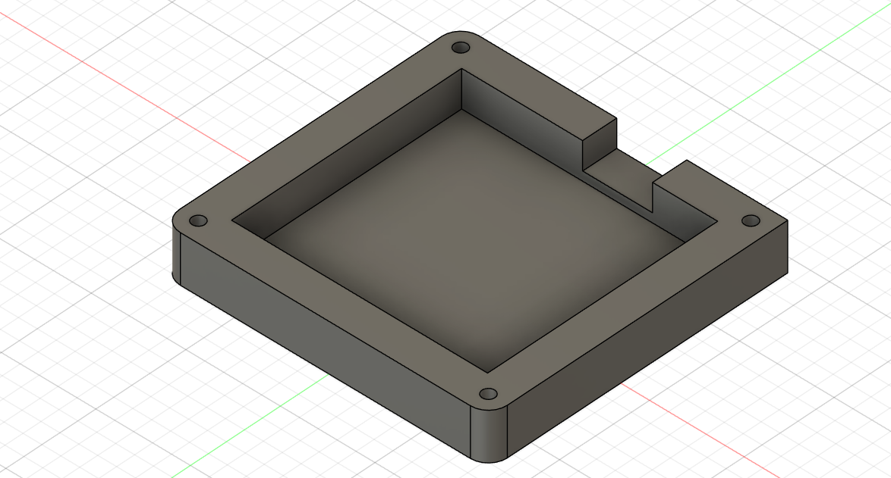

# KemoPad

## 🧠 Overview
**HACKPAD** is a compact macropad featuring 4 tactile push buttons and 2 SK6812 RGB LEDs for interactive lighting.  
It is powered by a Seeed XIAO RP2040 and uses **KMK firmware** built on CircuitPython.  
Designed to be minimal, responsive, and fully open-source for hardware hacking fun.

---

## 🧰 Features
- ✅ Seeed XIAO RP2040 (through-hole)
- ✅ 4 tactile push buttons (SW_Push)
- ✅ 2 SK6812 MINI RGB LEDs (individually addressable)
- ✅ PCB dimensions: **86.7mm x 82.9mm**
- ✅ Fully 3D printed case: **Top + Bottom**
- ✅ Supports KMK (CircuitPython) firmware
- ✅ Easy to modify and extend!

---

## 🖼️ Images

### 📘 Schematic  

### 🧾 PCB Layout  

### 🧱 3D Printed Case  

---

## 📦 Bill of Materials (BOM)

| Part               | Description                           | Qty |
|--------------------|----------------------------------------|-----|
| Seeed XIAO RP2040  | Microcontroller (through-hole)         | 1   |
| SK6812 Mini RGB    | Individually addressable RGB LED       | 2   |
| SW_Push            | Tactile push button                    | 4   |
| Resistors          | 10kΩ Pull-down                         | 4   |
| Capacitors         | 0.1µF Decoupling                       | 2   |
| Headers            | Male header pins                       | 1 set |
| 3D Printed Case    | Top.STEP, Bottom.STEP                  | 2 parts total |

---

## 🧪 Firmware

This macropad uses **KMK firmware** based on CircuitPython.  
Simply copy `main.py` into the root of your XIAO RP2040 CircuitPython drive.

### 📁 Firmware Folder:
Firmware/
└── main.py

You can modify `main.py` to assign macros, control LEDs, or handle advanced functionality.

---

## 📂 Project File Structure

HACKPAD/
├── CAD/
│ └── HACKPAD.step
├── PCB/
│ ├── HACKPAD.kicad_pcb
│ ├── HACKPAD.kicad_sch
│ └── HACKPAD.kicad_pro
├── Firmware/
│ └── main.py
├── production/
│ ├── gerbers.zip
│ ├── Top.STEP
│ ├── Bottom.STEP
│ └── firmware.uf2
└── README.md

---

## 🚀 License

This project is licensed under the MIT License — you can freely use, modify, and distribute it.

---

## 🙌 Author

Created by **Kareem Khaled**  
For Hack Club’s [Hackpad project](https://github.com/hackclub/hackpad) ❤️

